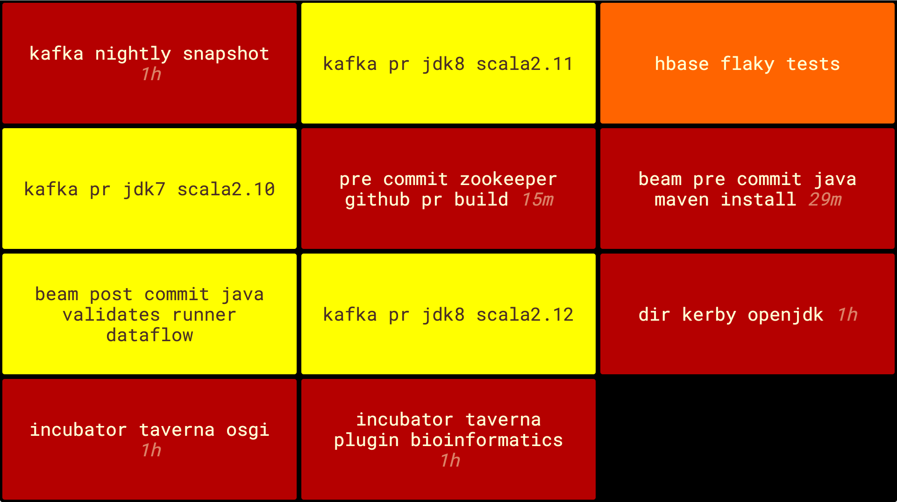

# Nevergreen

Nevergreen is a build monitor with attitude. It is awesome for two reasons:

* Your builds should always be green. Nevergreen understands this and only shows you jobs that have failed or are building.
* Nevergreen uses HTML localStorage. So the config is stored in your web browser. You only need to run it once to host hundreds of different build monitors.

Check out the demo at [http://nevergreen.io](http://nevergreen.io).



## Getting started

On the [tracking page](http://nevergreen.io/#/tracking) enter the url of your [cctray xml](wiki/find-cctray).

Additional help and information can be found on the [help page](http://nevergreen.io/#/help) of Nevergreen or in the [wiki](https://github.com/build-canaries/nevergreen/wiki).

## Build status

[](https://snap-ci.com/build-canaries/nevergreen/branch/master)
[](https://gitter.im/build-canaries/nevergreen?utm_source=badge&utm_medium=badge&utm_campaign=pr-badge&utm_content=badge)
[](http://jarkeeper.com/build-canaries/nevergreen)
[](https://david-dm.org/build-canaries/nevergreen.svg)

We are usually hanging out on the our [Gitter channel](https://gitter.im/build-canaries/nevergreen) if you'd like to chat.

## Contributing

You can run nevergreen locally by just running the ```develop.sh``` script. For more info see the [Contributing](https://github.com/build-canaries/nevergreen/wiki/contributing) section of our wiki.

If you would like to add a feature/fix a bug for us please create a pull request.

## License

Copyright © 2015 Build Canaries

Distributed under the Eclipse Public License either version 1.0 or (at your option) any later version.
