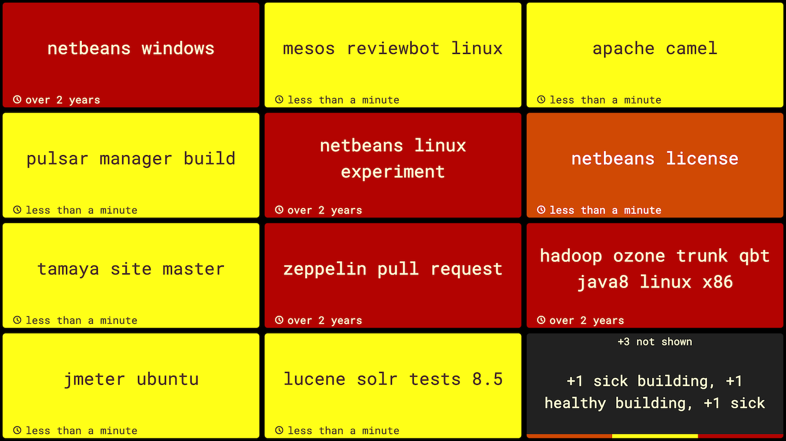
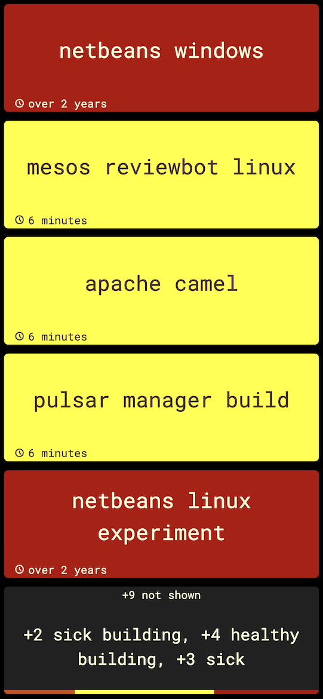

# Nevergreen

Nevergreen is a build monitor with attitude. Continually deliver via fast clear feedback.

-   Your builds should always be green. Nevergreen understands this and only shows you projects that have failed or are building
-   Nevergreen uses your local browser to store configuration. You only need to run it once to host different build monitors for every team
-   Nevergreen is fully responsive, it'll look just as good full screen or sharing the space with other dashboards
-   You can track as many CI servers as you like, allowing you to easily track dependent builds from other teams

## How do I start monitoring my builds?

You can use [hosted Nevergreen](https://nevergreen.io) at `nevergreen.io` or
[run Nevergreen locally](https://github.com/build-canaries/nevergreen/wiki/running-locally).

Once loaded:

1. Add the URL of your CCTray XML feed on the Tracking page
2. Head to the Monitor page to see their current status!

### How can I find my CCTray XML feed URL?

More information about how to get the CCTray XML feed for your CI server can be found on the official
[CCTray XML website](https://cctray.org/servers/).

### How can I get more help?

-   [The Nevergreen wiki](https://github.com/build-canaries/nevergreen/wiki)
-   [Tweet to @BuildCanaries](https://twitter.com/BuildCanaries) on Twitter
-   [Come chat to us on Slack](https://join.slack.com/t/nevergreen/shared_invite/zt-4towhx0w-7o6wJp0R_LwqXhGXb4niIA)
-   Nevergreen has built in help that can be accessed from the menu or by pressing the `h` key

## How can I fix a bug / add a feature / contribute?

You can run Nevergreen from source using the `./develop.sh` script. For more detailed information about running from
source please see the [contributing section of the wiki](https://github.com/build-canaries/nevergreen/wiki/contributing).

Please help us out by submitting a PR with any changes. We also keep a list of bugs / improvements / features using
[GitHub issues](https://github.com/build-canaries/nevergreen/issues), if you're looking for some inspiration.

You can also help us out by taking this [short usage survey](https://build-canaries.github.io/2015/09/14/nevergreen-survey.html), thanks!

## License

Copyright © 2014 - 2023 Build Canaries

Distributed under the Eclipse Public License either version 1.0 or (at your option) any later version.
